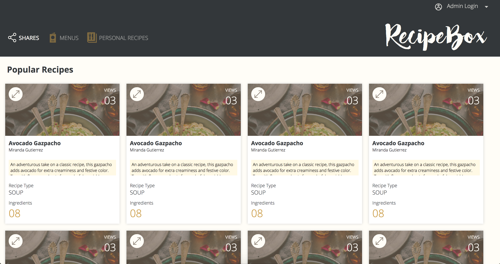
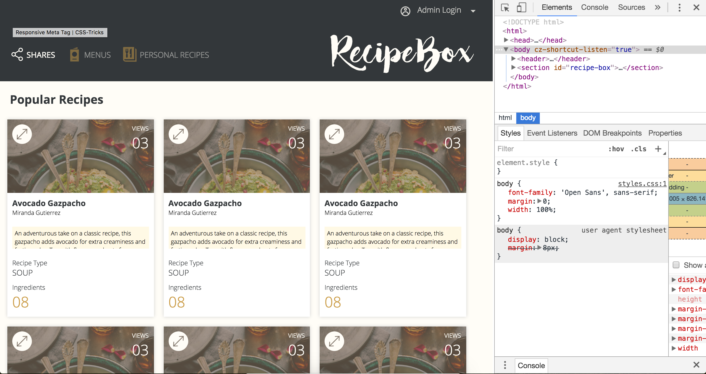
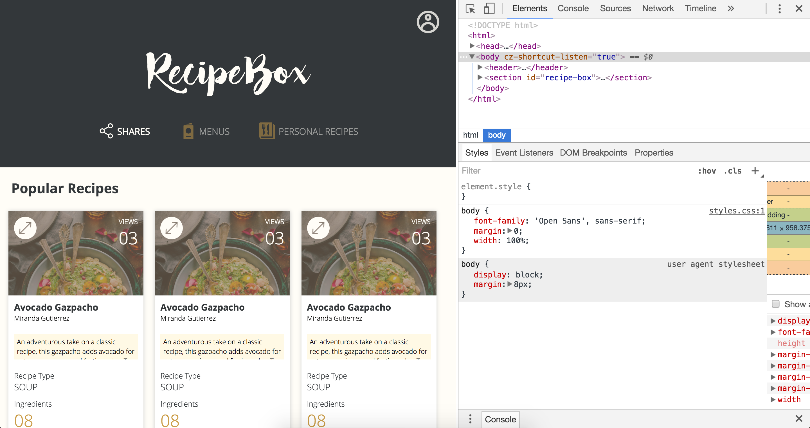
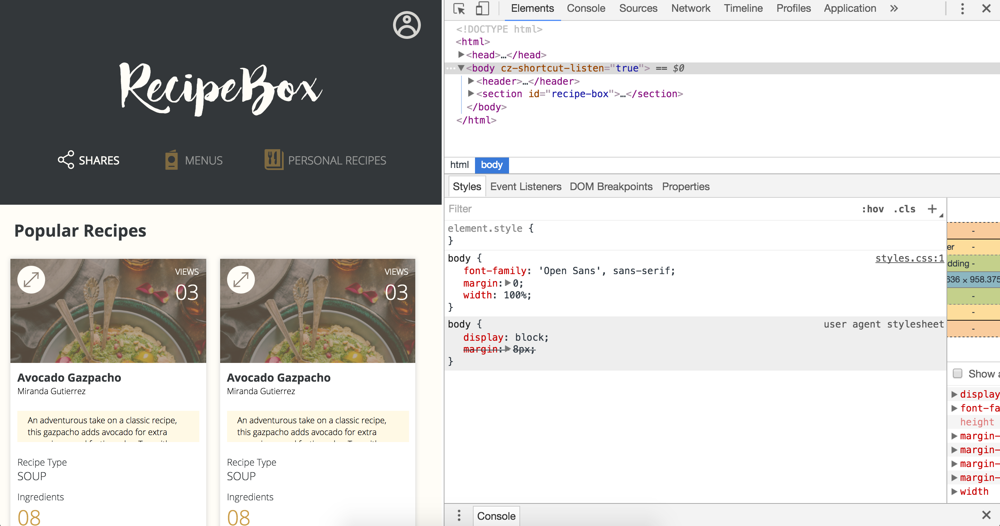
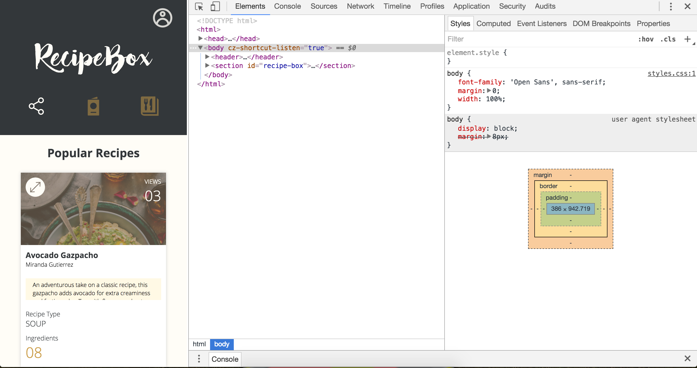

### lk-comp-challenge-2

-----

#### Overview
This is the second of three exercises in turning a static comp into a resopnsive site (html & css only).

The original comp (see below) was for a desktop view. The challenge was concerned with layout and left the colors, assets, and text open to interpretation.

-------

#####Original comp:

Below are a series of my version, which I themed as a site on which users can share and save recipes.

------------

#####Desktop view:

#####Tablet-ish views (landscape and portrait):

#####Phone-ish views:

